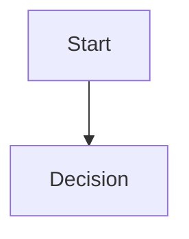
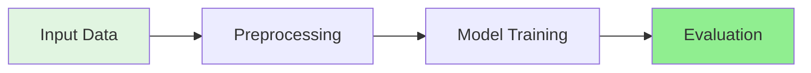

# Contributing to AI/ML/Data Engineering Complete Mastery

Thank you for your interest in contributing! This repository aims to provide comprehensive, pedagogical notebooks for learning AI/ML/Data Engineering with a focus on post-silicon validation and semiconductor applications.

## 🎯 Contribution Philosophy

- **Comprehensive over Quick**: Detailed explanations with mathematical foundations
- **Understanding over Memorization**: Implement from scratch, then use production libraries
- **Practical over Theoretical**: Real-world applications and business value
- **Systematic over Random**: Follow the learning roadmap structure

## 📋 Ways to Contribute

### 1. **Improve Existing Notebooks**

- Add more detailed explanations
- Fix errors or typos
- Improve code efficiency
- Add additional visualizations
- Enhance semiconductor/post-silicon examples

### 2. **Add New Notebooks**

- Check `NOTEBOOK_TRACKER.md` for planned but incomplete notebooks
- Follow the gold standard format: `010_Linear_Regression.ipynb`
- Must include:
  - Introduction with learning objectives and Mermaid diagrams
  - Mathematical foundations
  - From-scratch implementation
  - Production library implementation
  - 4-8 real-world project ideas (mix semiconductor + general AI/ML)
  - Comprehensive best practices and takeaways

### 3. **Add Real STDF Data Examples**

- Contribute anonymized semiconductor test data (STDF format)
- Add example analysis notebooks for wafer test data
- Share post-silicon validation use cases

### 4. **Improve Documentation**

- Update `README.md` with clearer instructions
- Enhance `MASTER_LEARNING_ROADMAP.md` with better organization
- Add more entries to `QUICK_REFERENCE.md`
- Create tutorial videos or blog posts

### 5. **Fix Bugs or Issues**

- Report bugs via GitHub Issues
- Submit pull requests with fixes
- Improve error handling in code

## 🚀 Getting Started

### Prerequisites

```bash
# Clone the repository
git clone https://github.com/rajendarmuddasani/ai-ml-data-engg-mastery.git
cd ai-ml-data-engg-mastery

# Create virtual environment (recommended)
python -m venv venv
source venv/bin/activate  # On Windows: venv\Scripts\activate

# Install dependencies (if requirements.txt exists)
pip install -r requirements.txt
```

### Required Python Packages

```python
numpy>=1.21.0
pandas>=1.3.0
scikit-learn>=1.0.0
matplotlib>=3.4.0
seaborn>=0.11.0
xgboost>=1.5.0
jupyter>=1.0.0
```

## 📝 Notebook Structure Requirements

Every notebook must follow this structure:

### **Required Sections:**

1. **Clear Introduction** (~200 lines)
   - 8+ learning objectives
   - Workflow/concept Mermaid diagram
   - Post-silicon validation context (4 applications with business value)
   - Mathematical foundations with intuitive explanations

2. **Theory Section** (~150+ lines per major concept)
   - Mathematical formulation with LaTeX
   - When to use (comparison table)
   - Advantages and disadvantages (4+ each)
   - Algorithm pseudocode
   - Practical guidelines
   - Common pitfalls with solutions (4+)

3. **Implementation Sections** (2 per concept)
   - **From Scratch**: NumPy-only educational implementation
   - **Production**: scikit-learn/XGBoost/etc. with hyperparameter tuning
   - Each with explanation cell preceding code cell

4. **Real-World Applications**
   - Post-silicon semiconductor scenario with code template
   - General AI/ML scenario with code template
   - Complete working examples

5. **Visualizations**
   - Minimum 2 Mermaid diagrams (workflow + concept/architecture)
   - Minimum 4 matplotlib/seaborn plots per implementation
   - Clear titles, labels, legends

6. **Projects** (4-8 ideas)
   - Balance: 50% semiconductor + 50% general AI/ML
   - Each with: objective, why technique matters, approach, success metrics, business value

7. **Key Takeaways** (~300+ lines)
   - Core principles with decision frameworks
   - Common pitfalls with solutions (5-6)
   - Production deployment guidelines
   - Semiconductor-specific recommendations
   - Resources for further learning

### **Code Cell Requirements:**

- Every code cell must have preceding markdown explanation cell
- Explanation must include:
  - **Purpose**: One sentence goal
  - **Key Points**: 4-7 bullet points with technical details
  - **Why This Matters**: Business value statement

### **Formatting Standards:**

```markdown
# Use emojis sparingly for headers
## 🎯 Learning Objectives
## 🚀 Boosting Methods

# Use LaTeX for math
$$\hat{y} = \frac{1}{M}\sum_{m=1}^{M} f_m(x)$$

# Use Mermaid for diagrams


# Use tables for comparisons
| **Aspect** | **Option A** | **Option B** |
|------------|--------------|--------------|
```

## 🔧 Development Workflow

### 1. **Fork & Branch**

```bash
# Fork the repository on GitHub, then:
git clone https://github.com/YOUR_USERNAME/ai-ml-data-engg-mastery.git
cd ai-ml-data-engg-mastery

# Create feature branch
git checkout -b feature/your-feature-name
```

### 2. **Make Changes**

- Follow notebook structure requirements above
- Test all code cells (ensure they run without errors)
- Use consistent naming: `NNN_Topic_Name.ipynb` (3-digit numbering)
- Add comments to complex code sections

### 3. **Update Documentation**

Update in this order:
1. **Notebook content** (code + explanations + diagrams)
2. **NOTEBOOK_TRACKER.md** - Mark status as ✅ and add details
3. **README.md** - Update section descriptions if scope changed
4. **MASTER_LEARNING_ROADMAP.md** - Update if prerequisites changed
5. **WORKSPACE_SUMMARY.txt** - Regenerate only if statistics changed

### 4. **Commit Changes**

```bash
# Stage your changes
git add .

# Commit with descriptive message
git commit -m "feat: Add notebook 046 - Feature Selection Methods

- Implemented filter, wrapper, embedded methods
- Added RFE, LASSO, tree-based selection
- Included 8 project ideas (4 semiconductor, 4 general)
- Complete with visualizations and best practices"

# Push to your fork
git push origin feature/your-feature-name
```

### 5. **Submit Pull Request**

- Go to GitHub and create Pull Request
- Title format: `feat: Add notebook NNN - Topic Name`
- Description must include:
  - What notebook/feature was added
  - Key concepts covered
  - Number of cells
  - Any new dependencies
  - Screenshots of visualizations (optional)

## 📐 Code Style Guidelines

### Python Code

```python
# Follow PEP 8
# Use meaningful variable names (not x, y unless mathematical context)
# Add docstrings for classes and functions
# Type hints where helpful

def calculate_feature_importance(X, y, model):
    """
    Calculate feature importance using permutation.
    
    Args:
        X (np.ndarray): Feature matrix (n_samples, n_features)
        y (np.ndarray): Target vector (n_samples,)
        model: Trained model with predict method
        
    Returns:
        np.ndarray: Importance scores per feature
    """
    # Implementation
    pass
```

### Markdown

```markdown
# Clear hierarchy with headers
# Use bold for **emphasis**
# Use code for `variable_names` and `function_names()`
# Tables for structured comparisons
# Numbered lists for sequential steps
# Bullet points for non-sequential information
```

## 🧪 Testing

Before submitting:

```bash
# Run all code cells in notebook
jupyter nbconvert --to notebook --execute your_notebook.ipynb

# Check for errors
# Verify visualizations appear correctly
# Ensure mathematical formulas render properly
```

## 🎨 Visualization Standards

### Matplotlib/Seaborn Plots

```python
# Always include:
- Clear title with context
- Labeled axes with units
- Legend (if multiple series)
- Grid for readability
- Consistent color scheme
- Font sizes readable (11-12pt)

# Example:
plt.figure(figsize=(10, 6))
plt.plot(x, y, label='Training Error', linewidth=2)
plt.xlabel('Iterations', fontsize=11, fontweight='bold')
plt.ylabel('Error', fontsize=11, fontweight='bold')
plt.title('Learning Curve: Error vs Iterations\nLower is Better', 
          fontsize=12, fontweight='bold')
plt.legend()
plt.grid(alpha=0.3)
plt.show()
```

### Mermaid Diagrams

```markdown
# Use for workflows, architectures, decision trees
# Keep diagrams clean and readable
# Use consistent colors/styling
# Add style definitions for clarity


```

## 📊 Semiconductor/Post-Silicon Context

Every notebook should include semiconductor applications:

### Required Elements:

1. **At least 4 post-silicon use cases** in introduction
2. **Real parametric measurements**: Vdd, Idd, frequency, temperature, power, leakage
3. **STDF context**: Mention data format, wafer structure, spatial correlation
4. **Business value**: Quantify savings ($5-10M annual, 2-3% yield improvement)
5. **GroupKFold validation**: When spatial correlation exists (wafer_id groups)

### Example Template:

```markdown
### **Semiconductor Example: Yield Prediction**

**Problem:** Predict device yield from parametric test data (Vdd, Idd, frequency).

**Challenge:** Spatial correlation (adjacent dies similar) → single model overfits.

**Solution:** Random Forest with GroupKFold by wafer_id.

**Expected improvement:**
- Single tree: R² = 0.75
- Random Forest: R² = 0.88
- Business value: 2-3% yield improvement = $5-10M annual savings
```

## 🤝 Review Process

1. **Automated checks** (if configured):
   - Code runs without errors
   - All cells have outputs
   - No broken links

2. **Manual review**:
   - Follows notebook structure requirements
   - Code quality and clarity
   - Mathematical correctness
   - Explanation quality
   - Visualization quality

3. **Feedback & Iteration**:
   - Address reviewer comments
   - Update pull request
   - Re-request review

4. **Merge**:
   - Approved PRs merged to main branch
   - Your contribution is credited!

## 🏆 Recognition

Contributors will be:
- Listed in `CONTRIBUTORS.md`
- Credited in notebook headers (if substantial contribution)
- Mentioned in release notes

## 📞 Communication

- **Issues**: Use GitHub Issues for bug reports, feature requests
- **Discussions**: Use GitHub Discussions for questions, ideas
- **Email**: For sensitive topics or private inquiries

## 📜 License

By contributing, you agree that your contributions will be licensed under the MIT License (same as this repository).

## 🙏 Thank You!

Your contributions help thousands of learners master AI/ML/Data Engineering systematically. Every notebook improvement, bug fix, or new example makes a difference.

**Happy Contributing! 🚀**

---

*Last Updated: December 2025*
