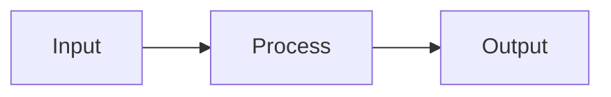

# Notebook Validation Checklist

**Purpose**: Automated validation checklist to ensure EVERY notebook meets quality standards before completion.

---

## ✅ MANDATORY CHECKS (Must Pass 100%)

### 1. Title Cell Structure (FIRST CELL)
- [ ] **Title Format**: `# NNN: Descriptive Title` (e.g., `# 103: Advanced Feature Engineering`)
- [ ] **Learning Objectives Section**: `## 🎯 Learning Objectives` with 5 bullet points
- [ ] **What Is Section**: `## 📚 What is [Topic]?` with 2-3 paragraphs
- [ ] **Why Section**: `**Why [Topic]?**` with 3-5 benefits using ✅ emoji
- [ ] **Use Cases Section**: `## 🏭 Post-Silicon Validation Use Cases` with 2-4 detailed use cases
  - Each use case must have: Input, Output/Engineered Features, Value statement
- [ ] **Workflow Diagram**: `## 🔄 [Topic] Workflow` with Mermaid diagram
- [ ] **Learning Path**: `## 📊 Learning Path Context` with Prerequisites and Next Steps

**Example Structure**:
```markdown
# 103: Advanced Feature Engineering

## 🎯 Learning Objectives

By the end of this notebook, you will:
- **Understand** [concept]
- **Implement** [technique]
- **Build** [system]
- **Apply** [to post-silicon validation]
- **Evaluate** [results]

## 📚 What is Feature Engineering?

[2-3 paragraphs explaining the concept...]

**Why Feature Engineering?**
- ✅ Benefit 1
- ✅ Benefit 2
- ✅ Benefit 3

## 🏭 Post-Silicon Validation Use Cases

**Use Case 1: [Name]**
- **Input**: [description]
- **Output**: [description]
- **Value**: [business impact with $ if possible]

[2-3 more use cases...]

## 🔄 Feature Engineering Workflow



## 📊 Learning Path Context

**Prerequisites:**
- **NNN**: [Previous topic]

**Next Steps:**
- **NNN**: [Next topic]
```

### 2. Code Cell Structure (20-70 Lines Each)
- [ ] **No cells exceed 100 lines** (CRITICAL - split if longer)
- [ ] **Each code cell has explanation markdown BEFORE it**
- [ ] **Meaningful blocks**: One concept per code cell (imports, data gen, algorithm, visualization, etc.)
- [ ] **Explanation template used**:
  ```markdown
  ## N. Section Title
  
  **Concept:** [One sentence]
  
  **Mathematics:** (if applicable)
  $$equation$$
  
  **Why It Works:** [Intuition]
  ```

### 3. Content Completeness
- [ ] **Imports cell**: All necessary libraries with organized groups
- [ ] **Data generation**: Synthetic STDF-like semiconductor data (1000+ samples)
- [ ] **From-scratch implementation**: Educational version showing math/logic
- [ ] **Production implementation**: sklearn/library version with best practices
- [ ] **Comparison**: Validate scratch vs production implementations
- [ ] **Visualization**: At least 2-4 subplot figure showing results
- [ ] **Project templates**: 4-8 real-world projects (NOT exercises)
- [ ] **Key takeaways**: When to use, limitations, best practices, next steps

### 4. Post-Silicon Validation Integration
- [ ] **Realistic parameters**: vdd, idd, freq, temp, power, yield, wafer_id, die_x, die_y, lot_id
- [ ] **STDF context**: References to IEEE 1505 standard, parametric tests
- [ ] **Business value**: $ savings, time-to-market, yield improvements
- [ ] **Balance**: 60% semiconductor examples + 40% general AI/ML examples

### 5. Mathematical Rigor
- [ ] **Equations use LaTeX**: Inline `$x^2$` or block `$$\beta = ...$$`
- [ ] **Symbol definitions**: Every variable explained
- [ ] **Worked examples**: Step-by-step calculations shown
- [ ] **Intuitive interpretation**: "What does this mean?" explanations

### 6. Visual Documentation
- [ ] **At least 2 Mermaid diagrams**: Workflow + (architecture OR concept)
- [ ] **Diagram styling**: Uses `style A fill:#e1f5ff` for visual appeal
- [ ] **Clear labels**: All nodes/edges have descriptive text

### 7. Project Templates (Not Exercises)
- [ ] **4-8 projects included** at end of notebook
- [ ] **Each project has**:
  - Clear objective
  - Success metric (quantified)
  - Business value statement
  - Feature/data suggestions
  - Implementation hints (not full solutions)
- [ ] **Mix of domains**: 50% post-silicon + 50% general AI/ML

### 8. Code Quality
- [ ] **PEP 8 compliance**: Proper naming, spacing, indentation
- [ ] **No placeholder code**: No `# TODO`, `# Your code here`, `pass` statements
- [ ] **Executable**: All cells run without errors
- [ ] **Reproducible**: Random seeds set (`np.random.seed(42)`)
- [ ] **Output shown**: Print statements verify results

### 9. Final Cell - Key Takeaways
- [ ] **Section header**: `## 🎓 Key Takeaways`
- [ ] **When to Use**: Clear decision criteria
- [ ] **Limitations**: Honest ⚠️ warnings about pitfalls
- [ ] **Best Practices**: Numbered list of production tips
- [ ] **Next Steps**: Links to related notebooks (104, 105, etc.)

---

## 🔧 VALIDATION PROCESS

**Step 1: Auto-Check Before Creation**
- Review this checklist
- Verify all 9 mandatory sections planned
- Ensure title format matches `# NNN: Title`

**Step 2: Post-Creation Validation**
- Open notebook in Jupyter
- Execute all cells top-to-bottom
- Verify no errors
- Check output quality

**Step 3: Documentation Update**
- Update `NOTEBOOK_TRACKER.md` status to ✅
- Update `README.md` if new notebook added
- Update `MASTER_LEARNING_ROADMAP.md` if prerequisites changed

---

## 📋 COMMON MISTAKES TO AVOID

❌ **NEVER DO THIS**:
1. Start notebook without title cell
2. Forget `# NNN:` number prefix in title
3. Create 700+ line code cells
4. Skip markdown explanations before code
5. Use generic examples (avoid "iris dataset", "titanic dataset")
6. Forget Mermaid diagrams
7. Create "exercises" instead of project templates
8. Skip post-silicon validation examples
9. Leave TODOs or incomplete code
10. Forget to update NOTEBOOK_TRACKER.md

✅ **ALWAYS DO THIS**:
1. Start with comprehensive title cell (all 7 subsections)
2. Keep code cells 20-70 lines (meaningful blocks)
3. Add markdown explanation before EVERY code cell
4. Include 2+ Mermaid diagrams
5. Use semiconductor STDF data examples
6. Provide 4-8 project templates with success metrics
7. Show both from-scratch and production implementations
8. Include complete visualizations (2-4 subplots)
9. End with key takeaways section
10. Test all code executes without errors

---

## 🎯 QUALITY SCORE

**Target: 100% Compliance**

| Category | Weight | Pass Threshold |
|----------|--------|----------------|
| Title Cell Structure | 20% | All 7 subsections present |
| Code Cell Structure | 20% | All <100 lines, explanations present |
| Content Completeness | 20% | All 8 sections included |
| Post-Silicon Integration | 15% | Realistic STDF examples |
| Mathematical Rigor | 10% | LaTeX equations with explanations |
| Visual Documentation | 5% | 2+ Mermaid diagrams |
| Project Templates | 5% | 4+ projects with metrics |
| Code Quality | 5% | Executable, no errors |

**Minimum Pass**: 90% (81/90 points)
**Target**: 100% (90/90 points)

---

## 🚀 QUICK REFERENCE

**Gold Standard Notebooks** (100% compliant):
- `078_Multimodal_LLMs.ipynb` - Perfect title structure
- `079_RAG_Fundamentals.ipynb` - Excellent introduction
- `010_Linear_Regression.ipynb` - Complete implementation pattern (34 cells, proper alternation)

**Use These as Templates!**

---

**Last Updated**: 2025-12-13  
**Version**: 1.0  
**Enforcement**: MANDATORY for all notebooks 103-109 and future additions
